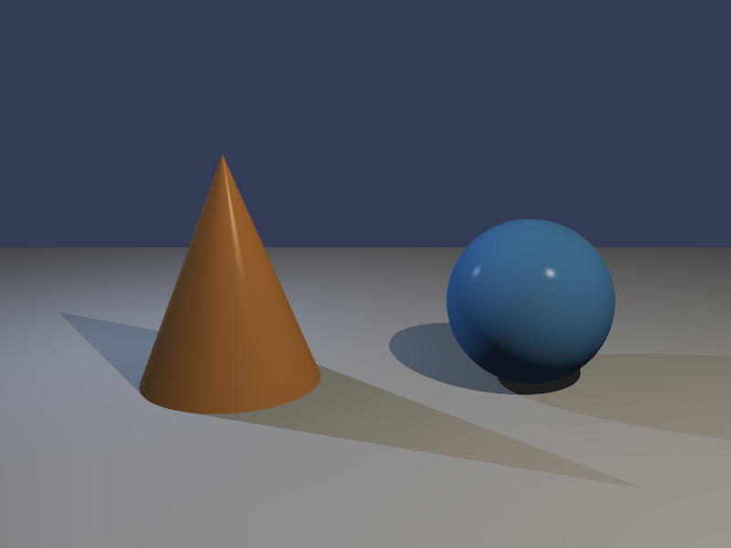

# c11-raytracer-fundamentals

用 **C11 + CMake** 實作的基礎光線追蹤器，附有深度教學文件，
逐行講解每段代碼背後的數學與物理知識。

這是一個學習導向的專案——目標不只是「跑出來」，
而是**理解每一行在計算什麼、以及為什麼這樣算**。

---

## 渲染結果

預設場景（圓錐體 + 球形 + 地板）的六個相機角度：

| 視角 | 說明 |
|------|------|
| view_0 | 正前方 45°——標準展示 |
| view_1 | 右側低角——球體高光效果 |
| view_2 | 左後俯角——錐體背面 + 地板陰影 |
| view_3 | 正上俯視 |
| view_4 | 極低草地角——輪廓剪影 |
| view_5 | 右前近距廣角——強透視感 |

---

### Demo picture

View_0 正前方 45°——標準展示


---

## 功能特性

| 功能 | 說明 |
|------|------|
| 幾何體 | 三角形（Möller–Trumbore）、球形（解析二次方程）、圓錐體（含底面圓盤） |
| 統一物件系統 | Tagged union（`GeomType` enum）——新增幾何體只需修改一個地方 |
| 光照模型 | Phong：環境光 + Lambert 漫射 + 鏡面高光 |
| 陰影 | 點光源硬陰影（Shadow Ray） |
| 光源衰減 | 二次衰減 `1/(1 + kl·d + kq·d²)` |
| 相機 | Pinhole 針孔相機，可控 position / lookat / FOV |
| 抗鋸齒 | Jitter 超採樣（可設定取樣數） |
| 輸出格式 | PNG——Gamma 2.2 校正，使用 zlib 在程式內直接編碼 |

---

## 專案結構

```
c11-raytracer-fundamentals/
├── CMakeLists.txt
├── GOLDEN_PROMPT.md       ← AI 輔助學習的可重現指南
├── include/
│   ├── vec3.h             ← 向量數學（全部 static inline，零外部依賴）
│   ├── ray.h              ← 光線：起點 + 方向
│   ├── camera.h           ← Pinhole 相機，右手座標系
│   ├── scene.h            ← Triangle / Sphere / Cone + 統一 Object 介面
│   └── renderer.h         ← 渲染器介面宣告
├── src/
│   ├── renderer.c         ← Phong 光照、渲染主迴圈、PNG 輸出
│   └── main.c             ← 場景定義、六角度批次渲染
└── docs/
    ├── 00_overview.md     ← 總覽與學習地圖
    ├── 01_vector_math.md  ← 向量數學
    ├── 02_ray_and_camera.md ← 光線模型與相機
    ├── 03_intersection.md ← 幾何求交
    ├── 04_lighting.md     ← 光照物理
    └── 05_rendering.md    ← 渲染管線
```

---

## 建置

**前置需求：** C11 編譯器、CMake ≥ 3.15、zlib（macOS / Linux / Windows MSYS2 均內建）。

```bash
mkdir build && cd build
cmake .. -DCMAKE_BUILD_TYPE=Release
make -j$(nproc)          # Linux / macOS
# cmake --build . --config Release   # Windows
```

## 執行

```bash
./raytracer
# 直接輸出 view_0.png … view_5.png，不需要額外轉換步驟
```

---

## 教學文件

`docs/` 資料夾包含六篇 Markdown 文件，內含 LaTeX 數學公式與代碼對照片段。
目標讀者：懂基礎 C 語言，但沒有學過電腦圖學或線性代數。

| 文件 | 主題 |
|------|------|
| `00_overview.md` | Ray Tracing 是什麼、演算法總覽、學習路線圖 |
| `01_vector_math.md` | Vec3：點積、叉積、正規化、反射向量完整推導 |
| `02_ray_and_camera.md` | 光線參數方程式、Pinhole 相機數學推導、FOV 幾何 |
| `03_intersection.md` | 直覺平面法 → Möller–Trumbore；球體與圓錐解析求交 |
| `04_lighting.md` | Lambert 定律、Phong 高光、衰減公式、Shadow Ray 物理意義 |
| `05_rendering.md` | 渲染主迴圈、取樣理論、Gamma 2.2 推導、PNG 格式結構 |

---

## 物理模型

**光線方程式：**

$$\vec{P}(t) = \vec{O} + t\,\vec{D}$$

**Möller–Trumbore 三角形求交：**

$$a = \vec{E_1} \cdot \vec{h},\quad u = \frac{\vec{S} \cdot \vec{h}}{a},\quad v = \frac{\vec{D} \cdot \vec{q}}{a},\quad t = \frac{\vec{E_2} \cdot \vec{q}}{a}$$

**Phong 光照模型：**

$$I = I_a K_a + \sum_{\text{lights}} \frac{1}{1+k_l d+k_q d^2}\left[I_l K_d\max(0,\hat{N}\cdot\hat{L}) + I_l K_s\max(0,\hat{R}\cdot\hat{V})^n\right]$$

**Gamma 校正（線性空間 → sRGB）：**

$$V_{\text{out}} = V_{\text{linear}}^{1/2.2}$$

---

## 擴展路線圖

`scene.h` 的 `Object` tagged union 設計上便於新增幾何體，
依實作難度排列的計畫項目：

| 幾何體 | 實作方法 | 難度 |
|--------|---------|------|
| 無限平面 Plane | 點法式平面方程 | ★☆☆ |
| 圓柱體 Cylinder | 二次方程 + 上下圓盤蓋 | ★☆☆ |
| 有限圓盤 Disk | 平面求交 + 半徑範圍測試 | ★☆☆ |
| 軸對齊包圍盒 AABB / Cube | Slab method（三對區間） | ★★☆ |
| 有限矩形 Rect | 平面求交 + UV 邊界測試 | ★★☆ |
| 圓環體 Torus | 四次方程式 | ★★★ |
| 三角網格 Mesh | MT 逐三角形 + BVH 加速 | ★★★ |
| CSG 布林運算（聯集 / 差集 / 交集） | $t$ 區間集合運算 | ★★★ |

---

## 配合 AI 學習

本專案附有 `GOLDEN_PROMPT.md`——一套結構化的 Prompt，
可以貼給任何 AI 助手（Claude、GPT-4 等）從零重現整個專案，
再一步步依照路線圖擴充。

學習哲學：**先理解，再擴充。**
讀文件、追蹤數學推導，再問 AI 你看不懂的那一行。

---

## 依賴項目

| 依賴 | 用途 | 備註 |
|------|------|------|
| C11 標準函式庫 | 全部核心功能 | 無其他 C 函式庫依賴 |
| zlib | PNG DEFLATE 壓縮 | 各平台系統內建 |
| CMake ≥ 3.15 | 建置系統 | |

---

*本專案是 `GOLDEN_PROMPT.md` 所記錄的 AI 輔助學習工作流程的配套實作。*

---

## 授權

- 本專案採用 [MIT License](./LICENSE) 授權。
- Copyright © 2026 [KUNYI CHEN](https://github.com/KunYi)
- 專案位址：<https://github.com/KunYi/c11-raytracer-fundamentals>
